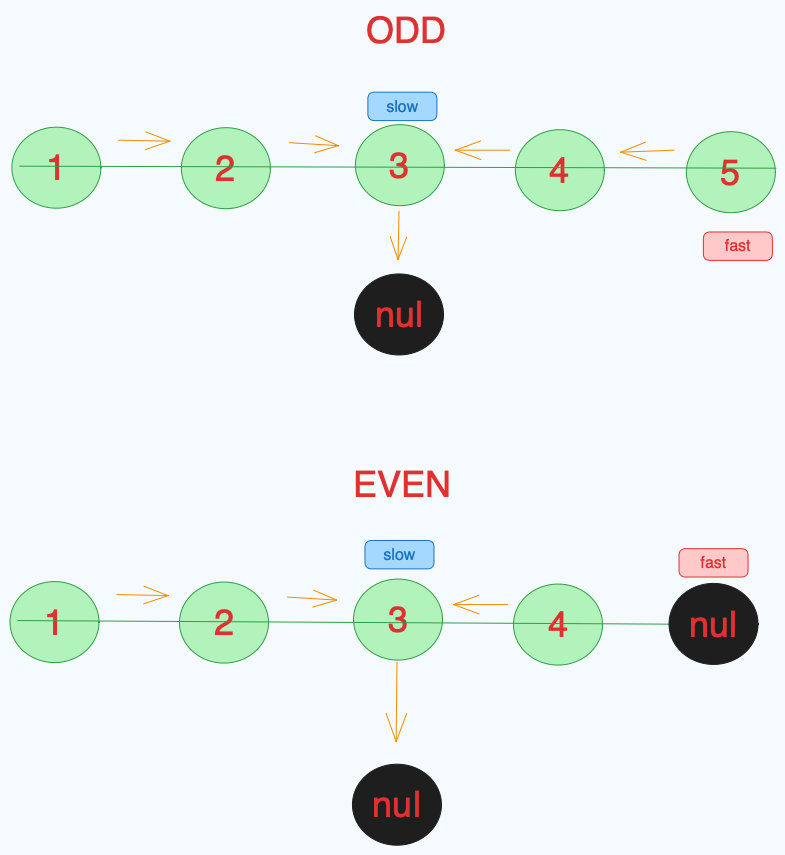
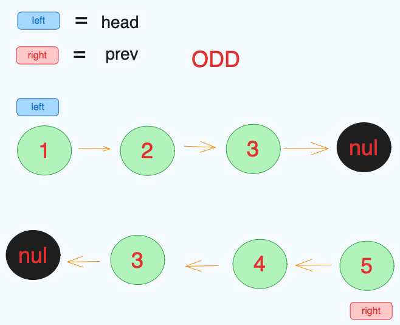
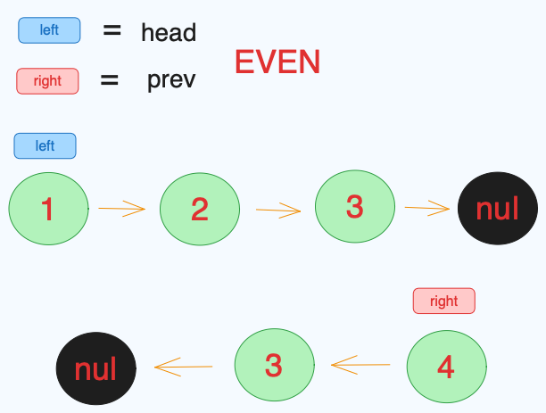

# Remove Duplicates from Sorted Array

## Rules

Given the `head` of a singly linked list, return `true` if it is a palindrome or `false` otherwise.

## Example 1

Input: head = [1,2,2,1]<br>
Output: true

## Example 2

Input: head = [1,2]<br>
Output: false

## First Approach

The first approach is uactually not using the linklist to determine if it palindrome or not, but using an array. So first thisng we need to do just iterate all the linklist and push it into the array and determine if its palindrom in array shape.

<h3> --Code--</h3>

```javascript
var isPalindrome = function (head) {
  let current = head;
  let arr = [];
  while (current) {
    arr.push(current.val);
    current = current.next;
  }
  let pointer2 = arr.length - 1;
  for (let pointer1 = 0; pointer1 < Math.floor(arr.length / 2); pointer1++) {
    if (arr[pointer1] != arr[pointer2]) {
      return false;
    }
    pointer2--;
  }
  return true;
};
```

<h3> --Complexity--</h3>

Time Complexity O(n)

- since, it only iterate the array once

[Space] Complexity O(n)

- since, it dosent add more memory

## Better approach

in this approach we combile fast & slow algorythm with how 2 pointers like we do the array above.

<h3>--Code--</h3>

```javascript
var isPalindrome = function (head) {
  let slow = head;
  let fast = head;
  // divide th linklist in two half part
  while (fast && fast.next) {
    slow = slow.next;
    fast = fast.next.next;
  }
  //reverse the first half of the link list
  let prev = null;
  while (slow) {
    const temp = slow.next;
    slow.next = prev;
    prev = slow;
    slow = temp;
  }

  let left = head;
  let right = prev;

  // using two pointers and iterate each single node to make sure its the same value (palindrom)
  while (right) {
    if (right.val != left.val) {
      return false;
    }
    left = left.next;
    right = right.next;
  }
  return true;
};
```

## How The Code Works Visualy

- this is how the patterns look like visualy in the first while loop
  

- this is how the patterns look like visualy in the second while loop for `ODD`
  

- this is how the patterns look like visualy in the second while loop for `EVEN`
  

## Complexity

Time Complexity `O(n)`

Space Complexity `O(1)`
