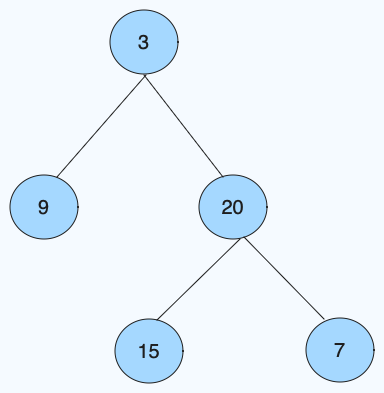
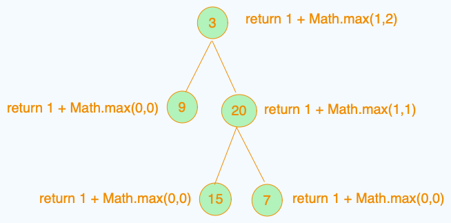

# Maximum Depth of Binary Tree

## Rules

Given the root of a binary tree, return its maximum depth.

A binary tree's maximum depth is the number of nodes along the longest path from the root node down to the farthest leaf node.

## Example 1

Input: root = [3,9,20,null,null,15,7]
Output: 3

## Example 2

Input: root = [1,null,2]
Output: 2

## The Problem that we will use as a example toward this tutorial



---

## Recursion Approach

```javaScript
    var maxDepth = function(root) {
    if(!root){
        return 0
    }
    return 1 + Math.max(maxDepth(root.left),maxDepth(root.right))
};
```

### Code Visualy



---

## BDS

NOTE<br>
in this approach we use additional loop inside while loop to figure the which level are we in.

```javaScript
var maxDepth = function(root) {
    while(queue.length!=0){
        /* variable "q" is used for the memory so
        then when it dosent add  when the
        another node get pushed
        */
        let q = queue.length
        // loop only for the first level
        for(let i = 0;i<q.length;i++ ){
            // get the current node and also put out from the node
            let currNode = queue.shift()
            if(currNode.left){
                queue.push(currNode.left)
            }
            if(currNode.right){
                queue.push(currNode.right)
            }
        }
        // add the level evertime while loop restart
        level++
    }
    return level
}
```

## ITERATIVE DFS

```javaScript
var maxDepth = function(root) {
    //edge cases
    if(root===null){
        return 0
    }

    let stack=[[root,1]], res=1
    while(stack.length!==0){
        const data=stack.pop(), node=data[0], depth=data[1]
        if(node!== null){
            res=Math.max(res,depth)
            stack.push([node.right,depth+1])
            stack.push([node.left,depth+1])
        }
    }
    return res
};
}
```
